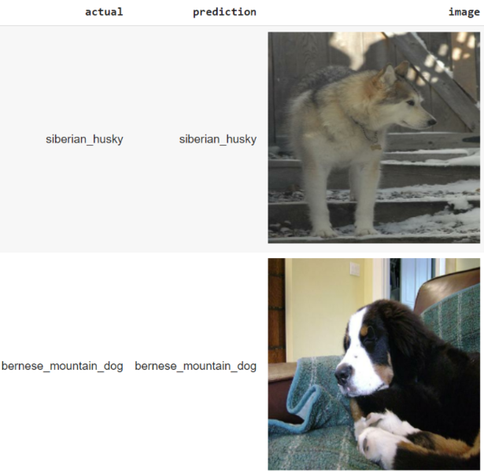

# Image Classification
* Goal: Classify dog breeds from images
* Data: Stanford Dogs Dataset (http://vision.stanford.edu/aditya86/ImageNetDogs/), reduced size (five breeds, 926 images)
* Reference: DataQuest
* Tools: Tensorflow
* Prediction Samples

